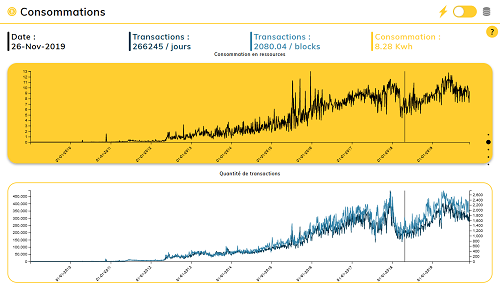

# Data Visualisation - Blockchain Mining Visualisation

[Go to the website](https://ardailler.github.io/Dataviz_blockchain/)

As the bitcoin usage expands every day, people may be concerned by the
environmental impact of this technology.

This website helps people to visualize what are the cost of Bitcoin in term of
power and data consumption for the transaction part and the mining part. While
the transaction cost is very low, the mining consumes a lot of power. However
the mining activity can be very profitable.

## How to deploy the website

### Install

*Clone the project*

- `git clone https://github.com/ardailler/Dataviz_blockchain.git`
- `cd Dataviz_blockchain/blockchain`

*Install the dependencies*

- Install `npm`
- Use `npm install` to install the `node_module` used in the project. You only
have to do this step once.

### Deploy
- `npm run dev` to deploy with hot load (the changes in the code will be
displayed on the website automatically). The address will be displayed in the
console.
- `npm run build` to generate the static webpage found in the `docs` folder.

